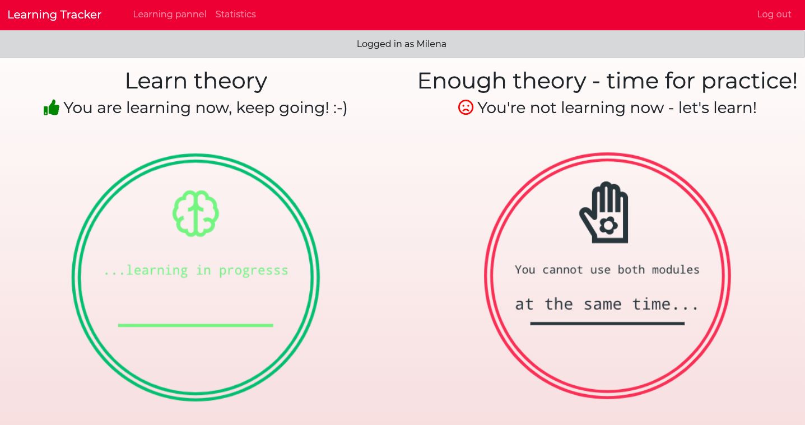
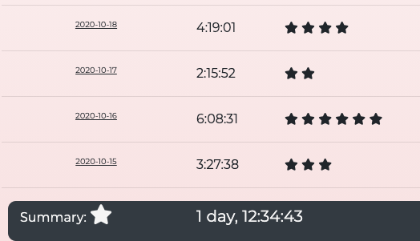

# ToDo Lists

## General info

This app allows you to track your learning progress. \
After creating an account you can see two buttons at the homepate - click one of them when you start learning theory or practicing some skills. \
Then, click the button to end your current learning session. \
Your progress will be saved in "Statistics" section - for each hour of learning you receive a star as a "reward".


## Table of contents
* [Screenshots](#screenshots)
* [Setup](#setup)
* [Usage](#usage)
* [Owner](#owner)
* [License](#license)

## Track your learning progress



## Setup
### Clone the source:

```shell
$ git clone https://github.com/milenakowalska/learning-tracker
$ cd learning-tracker
```
### Install packages

```shell
$ pip3 install -r requirements.txt
```
### Run and open the app

Run the code in terminal:

```shell
$ python3 manage.py runserver
```

According to the displayed information: "Starting development server at http://127.0.0.1:8000/",  \
open the app in browser using the link http://127.0.0.1:8000/

## Usage

First you need to create your account using the "Register" option. \
When you log in, you can click on "Learning pannel" and start your first learning session. \
End the session by clicking the green button, which indicates the current learning session. 

Your progress will be monitored in the "Statistics" section. \
Track your learning sessions every day and stay motivated to learn!

## Owner
Created by milenakowalska.

## License
[](https://opensource.org/licenses/Apache-2.0)

- **[ Apache 2.0 License ](https://choosealicense.com/licenses/apache-2.0/)**
